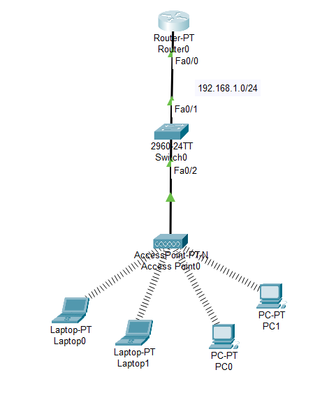
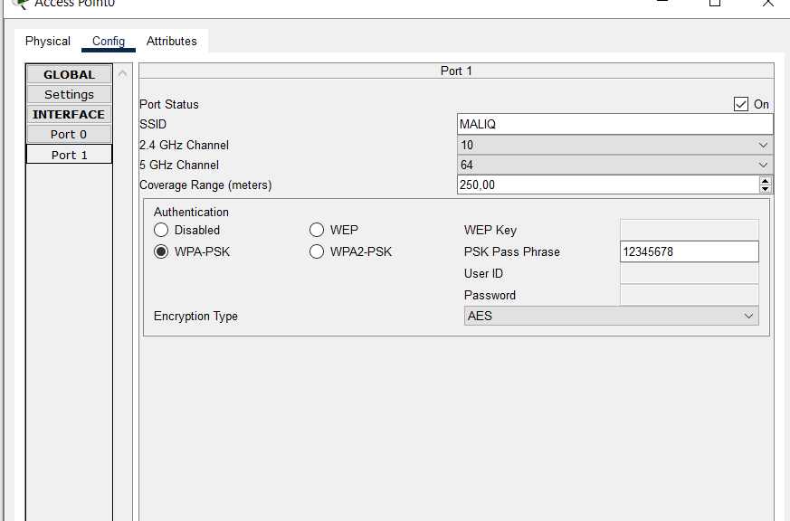
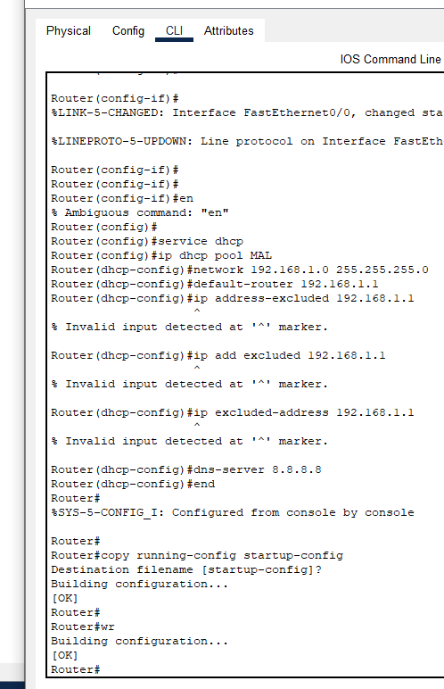

# Wireless Configuration + DHCP Static

This repository contains base configuration for wireless network with DHCP static assignment using Cisco/MikroTik devices.

## 📁 File Structure

```
/assets
├── APCONFIG.png      # Access Point Configuration
├── cisco.pkt         # Cisco Packet Tracer File
├── ROUTERCLI.png     # Router CLI Configuration
└── topology.png      # Network Topology Diagram
```

## 📋 Description

This project provides configuration templates for:
- **Wireless Network Configuration** - Basic Access Point setup
- **DHCP Static Binding** - DHCP configuration with static IP based on MAC address
- **Router Configuration** - Router configuration for wireless network

## 🛠️ Equipment Used

- Cisco/MikroTik Router
- Wireless Access Point
- DHCP Server (integrated on router)

## 📸 Screenshots

### Network Topology


### Access Point Configuration


### Router Configuration


## 🚀 How to Use

1. **Open Packet Tracer File**
   ```
   Open cisco.pkt using Cisco Packet Tracer
   ```

2. **Review Configuration**
   - Check AP configuration in APCONFIG.png
   - View CLI commands in ROUTERCLI.png for router setup

3. **Implementation**
   - Adjust IP addresses according to your network requirements
   - Configure DHCP static binding for specific devices
   - Set SSID and wireless security as needed

## 📝 Key Features

- ✅ Wireless network configuration
- ✅ DHCP server with static IP assignment
- ✅ Basic router configuration
- ✅ Network topology documentation

## 🔧 DHCP Static Configuration

DHCP static binding allows specific devices to always receive the same IP address based on their MAC address. This is useful for:
- Servers
- Network printers
- IoT devices
- Devices requiring fixed IP addresses

## 📚 References

- Cisco Packet Tracer
- Cisco IOS Configuration Guide
- Wireless Network Standards (IEEE 802.11)

## 📄 License

Free to use for learning and development purposes.

## 🤝 Contributing

Feel free to fork this repository and submit pull requests for improvements or additional features.

---

**Note**: Make sure you have Cisco Packet Tracer installed to open `.pkt` files
